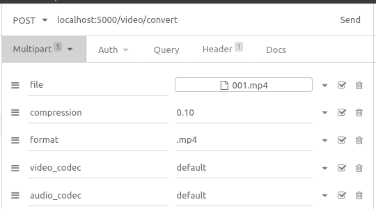

# Go Video Converter

## Description
Video converter built with Golang and supported by `ffmpeg` as converter

## How to use it

### Running from docker registry
- Pull image
```shell
docker pull registry.gitlab.com/prosa-backend-test/video-converter
```
- Run container
```shell
docker container run --name vidconv -d -p 5000:5000 registry.gitlab.com/prosa-backend-test/video-converter
```

### Running from source code
- Clone this project
```shell
git clone git@gitlab.com:prosa-backend-test/video-converter.git
```

- Setup
```shell
make setup
```

- Run
```shell
make all
```

- Access the API

    Prepare the request like this
    
    